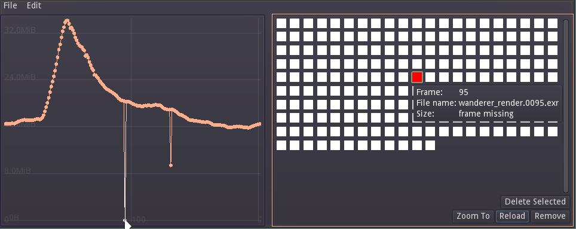
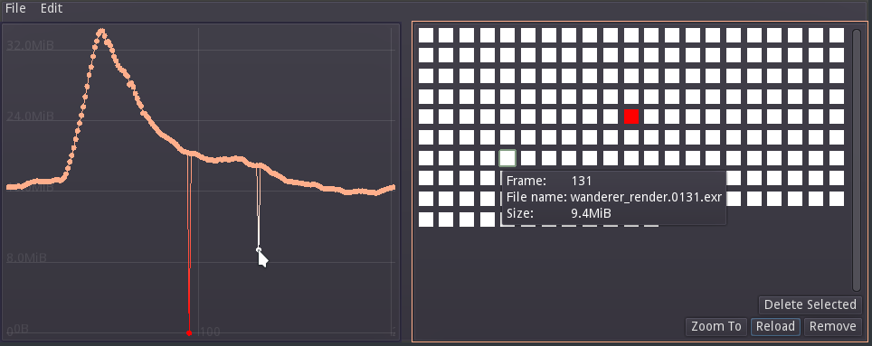

# Filesize Graph

An experimental image sequence size visualiser

## Introduction

This utility may be used in animation or VFX studios, or any environment where
you'd need to visualise the size of files (generally compressed images) in a
sequence.  
It was developped at animation studio [Les Fées
Spéciales](http://les-fees-speciales.coop/) from a previous
[prototype](https://github.com/LesFeesSpeciales/filesize-graph) in
Blender.

The main use case is during rendering of long and heavy image
sequences, to check for missing frames, empty frames, or other
rendering glitches, including:
* file corruption
* missing objects
* rig or animation glitch / jerky movements
* missing render passes
* an old version of an image has remained while overwriting the
  sequence
* generally, anything which would cause a specific image to be
significantly more different from its neighbours than is expected.

It relies on the fact that a given animated shot usually behaves in a
smooth, continuous movement, and does not jump everywhere. Otherwise,
it may be called a *cut*, and then it's not the same shot anymore.  
It also relies on the fact that two images that look roughly the same
tend to have roughly the same size once compressed. So, if you have a
big discontinuity, you just may have a glitch worth investigating in
an image.

Please note that it is not magical, and does not exempt you from
checking the sequence with your own or someone else's eyes. But it did
relieve some stress on long rendering nights preceding deadlines.

## Getting Started

To open an image sequence, use File → Open Sequence and select a file from your
sequence, or drag and drop a file to the window.  
A graph will appear in the left pane, a list of images represented as
squares in
the right pane.  
Sequences are assigned a colour to help identify them.  
Missing images appear as a red point in the left pane, and as a red
square in the right pane.

You can navigate the graph by using the middle mouse button to pan.
Zoom by using the mouse wheel, or CTRL + middle mouse button to zoom either axis.  
You may also click “Zoom To” in the list pane to frame the sequence in
the graph view.



In this example, you may also notice a drop in the graph, which means
that an image in the sequence is lighter than those surrounding it.
This may be worth investigating... By hovering the point, a popup
appears, which indicates the file size, name and frame number.



If part of the sequence appears corrupted or otherwise needs
re-rendering, you can select it by clicking and dragging on the graph,
and selecting “Delete Selected” in the list pane. Note that you can
use the SHIFT and CTRL modifier to add to or subtract from the
selection, respectively.


### Installing

Latest binary releases may be found
[here](https://github.com/PiOverFour/filesize-graph/releases).

### Building from source

You will need to install the [Godot game engine](https://godotengine.org/)
version [4](https://godotengine.org/download/), as well as the matching export templates.

To compile from source, download or clone the project and open it in
the Godot Engine editor, and follow the procedure outlined
[here](https://docs.godotengine.org/en/4.0/tutorials/export/exporting_projects.html).
Alternatively, you can use the command line instructions described on
[this page](https://docs.godotengine.org/en/4.0/tutorials/editor/command_line_tutorial.html#exporting).

On GNU/Linux, I use the following command:

```bash
cd filesize-graph
mkdir -p export/filesize-graph.x11/
godot --export-release "Linux/X11" ./export/filesize-graph.x11/Filesize-Graph.x86_64

cd export
strip filesize-graph.x11/Filesize-Graph.x86_64
zip -r filesize-graph.x11.zip filesize-graph.x11/*
```

`strip` is used to get a lighter binary by stripping debug symbols.
More about this can be read
[here](http://docs.godotengine.org/en/latest/development/compiling/optimizing_for_size.html).

## Author

Copyright © 2018-2025 Damien Picard dam.pic AT free.fr
Copyright © 2018-2025 Les Fées Spéciales voeu AT les-fees-speciales.coop

## License

This program is free software: you can redistribute it and/or modify
it under the terms of the GNU General Public License as published by
the Free Software Foundation, either version 3 of the License, or
(at your option) any later version.

This program is distributed in the hope that it will be useful,
but WITHOUT ANY WARRANTY; without even the implied warranty of
MERCHANTABILITY or FITNESS FOR A PARTICULAR PURPOSE.  See the
GNU General Public License for more details.

You should have received a copy of the GNU General Public License
along with this program.  If not, see <http://www.gnu.org/licenses/>.
